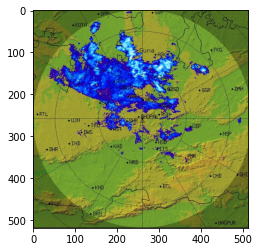
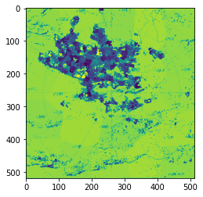
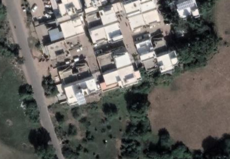

# Computer-Vision Projects

## Improved Unsupervised Multi-level Clustering for Segmentation of Remote Sensing Imageries Containing Embedded Objects 

You can view the project documentation (white paper) in PDF format:
- [Download PDF](paper.pdf)

|  |  |
| --- | --- |
| <h3 align="center">Original Radar data Image</h3> | <h3 align="center">Clustered image after merging</h3> |

Above Provided Figures shows the clustering of the cloud data. The Image in the left hend side is showing the original Image which is 2D representaion of one the radar reading(DB-z) over the cordinates. And the figure on the right side is the outcome of the clustering approach. 

In real, there are many other parameters which are acccountable for cloud data clustering. And Also the data is also in 3D space.

### Algorithm of the project :

### Provided Notebook 
In the provided notebook, I have shown, the algorithm approach on google earth image, on which I have tried to solve **the image segementation problem** into geo-graphical objects like (farm-land, Residential area, Roads, etc).
 

### The Results for the given notebook :
| Original Image |  |
| --- | --- |
| Clustered Image after 7 iterations |  |

## Results :
## For checking the proposed method improvement, I have used the Silhouette-Score for confirming the cluster separability.

